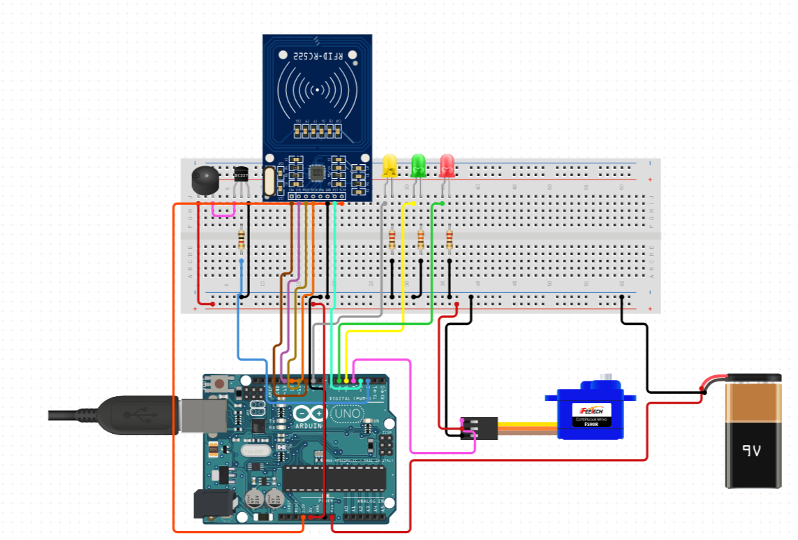
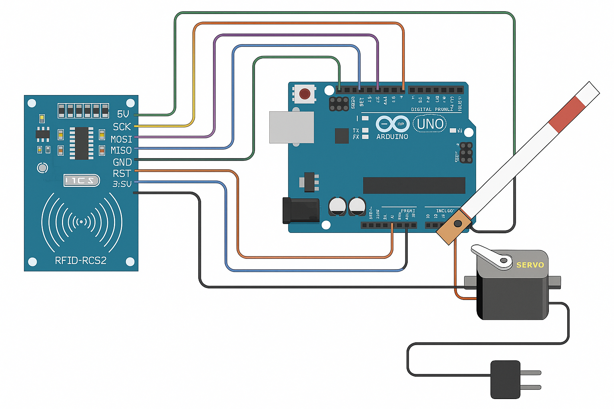

# BOOM_BARRIER_SYSTEM_USING_RFID
This project was part of my subject Foundation Skills in Sensor Interfacing (FSSI). It helped me understand how sensors like RFID work and how to interface them with microcontrollers for real-world applications.

# 🚧 RFID-Based Boom Barrier System using Arduino

A beginner-friendly project that uses **RFID technology** and **Arduino** to control a **servo motor-operated boom barrier**, enabling access control based on authorized RFID tags.

This was my **first hardware project** in my subject **FSSI (Foundation Skills in Sensor Interfacing)**, where I got hands-on experience with sensors and microcontrollers. Through this project, I learned how RFID sensors work, how servo motors can be controlled, and how real-time access systems operate.

---

## 🔧 How It Works

1. **Scan an RFID card** near the RFID reader (RC522).
2. If the tag is **authorized**, the **servo motor lifts** the boom barrier.
3. If unauthorized, the **barrier remains closed**, and feedback is shown via LEDs.

---

## 🧰 Hardware Used

- 🔷 **Arduino Uno** (Microcontroller)
- 📶 **RFID Reader (RC522)**
- 🪪 **RFID Tags/Cards**
- 🔁 **Servo Motor (SG90 or MG995)**
- 💡 **LEDs (Red, Yellow, Green)**
- 🔌 **Breadboard & Jumper Wires**

---

## 🔌 Circuits : 

### 🖼️ Circuit

> Refer to the diagram below made by me :

> Refer to the diagram below made by me :

### 🧾 Connections

#### RFID RC522 ↔ Arduino UNO

| RC522 Pin | Arduino Pin |
|-----------|-------------|
| VCC       | 3.3V        |
| GND       | GND         |
| RST       | Pin 9       |
| MISO      | Pin 12      |
| MOSI      | Pin 11      |
| SCK       | Pin 13      |
| SDA       | Pin 10      |

#### Servo Motor ↔ Arduino UNO

| Servo Pin | Arduino |
|-----------|---------|
| VCC       | 5V      |
| GND       | GND     |
| Signal    | Pin 7   |

### 📜 Code Instructions

1. Install required libraries:
   - `MFRC522` for RFID module
   - `SPI` (comes with Arduino IDE)

2. Upload the Arduino sketch (`boom_barrier.ino`) to the board.

3. Open Serial Monitor (9600 baud) to view scanned tag IDs.

4. Add scanned IDs to the `Tag[]` array in the code for access.

5. Power the circuit, scan a tag, and watch the boom lift if access is granted.

---

## 💡 What I Learned

- How **RFID technology** enables contactless identification.
- Basics of **servo motor control** using PWM.
- Working with **LED indicators** to give real-time status feedback.
- Introduction to **SPI communication** and **sensor interfacing**.
- Practical experience in debugging hardware + code together.

---

## ⚠️ Challenges Faced

- Difficulty understanding **pin mapping and wiring** for the RFID module initially.
- Getting the **servo motor angle control** right with custom PWM logic.
- Reading and converting **hex UID values** of RFID cards.
- Debugging inconsistent behavior due to **power supply fluctuations**.
- Managing **timing and synchronization** between LED signals and servo response.

---

## 🚀 Future Enhancements

- ✅ Add a **buzzer** for sound feedback.
- ✅ Integrate a **display (LCD or OLED)** to show user messages or tag info.
- 🔐 Create a **secure database or EEPROM** storage for authorized tag IDs.
- 🌐 Connect to a **web server or IoT platform** for logging access events.
- 📱 Add **mobile app integration** using Bluetooth/Wi-Fi.
- 🔋 Improve **power management** for longer outdoor use.

---

